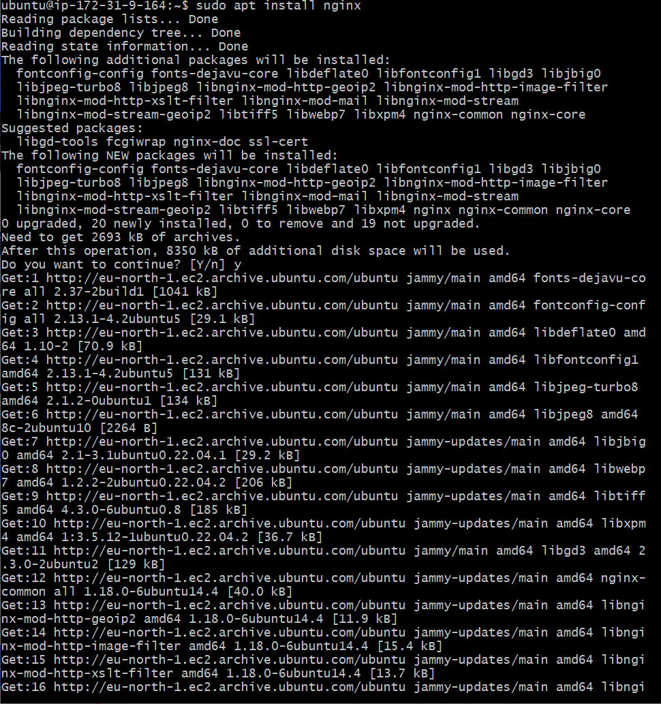

# LEMP STACK IMPLEMENTATION

## STEPS 1-11

> Launch an EC2 instance on the virtual server (AWS, in this case)

### 1) Connect to the instance using your private key
   

### 2) Install nginx on the machine
   

### 3) Check the status of the nginx server
   

### 4) Connect to your public IP to test the nginx server
   
   
   
### 5) Install mysql on the machine
   

### 6) Run a secure installation for mysql
   

### 7) Install php packages on the machine
   

### 8) Configure nginx to use php processor
   

### 9) Display test output after running it through a browser
   

### 10) Testing a php script to confirm it's correctly installed
   

### 11) Retrieving data from mysql database with php
   
   
